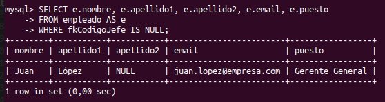
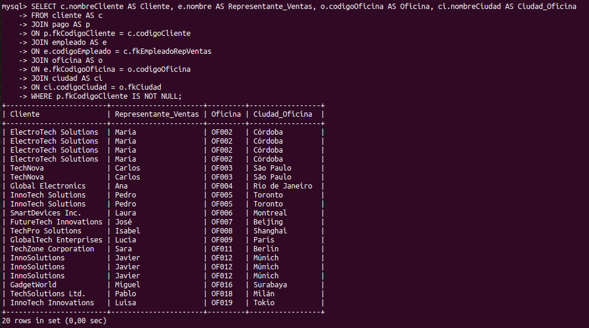

# MySQL_Cristopher_Buitrago

## CONSULTAS

### 1. Devuelve un listado con el código de oficina y la ciudad donde hay oficinas.

``` sql
SELECT o.codigoOficina AS Cod_Oficina, c.nombreCiudad AS ciudad
FROM oficina AS o
JOIN ciudad AS c
ON c.codigoCiudad = o.fkCiudad
WHERE o.fkCiudad IS NOT NULL;
```


### 2. Devuelve un listado con la ciudad y el teléfono de las oficinas de España.
``` sql
SELECT c.nombreCiudad AS Ciudad, o.telefono AS Telefono_Oficina, o.codigoOficina AS Cod_Oficina
FROM oficina AS o
JOIN ciudad AS c
ON c.codigoCiudad = o.fkCiudad
WHERE o.fkPais = 'ESP';
```


### 3. Devuelve un listado con el nombre, apellidos y email de los empleados cuyo jefe tiene un código de jefe igual a 7.
```sql
SELECT e.nombre, e.apellido1, e.apellido2, e.email
FROM empleado AS e
WHERE e.fkCodigoJefe = 7; /*En mi base de datos no se encuentra un jefe con codigo 7*/
```


### 4. Devuelve el nombre del puesto, nombre, apellidos y email del jefe de la empresa.

```sql
SELECT e.nombre, e.apellido1, e.apellido2, e.email, e.puesto
FROM empleado AS e
WHERE fkCodigoJefe IS NULL;
```


### 5. Devuelve un listado con el nombre, apellidos y puesto de aquellosempleados que no sean representantes de ventas.
```sql
SELECT e.nombre, e.apellido1, e.apellido2, e.puesto
FROM empleado AS e
WHERE puesto != 'Representante ventas';
```


### 6. Devuelve un listado con el nombre de los todos los clientes españoles.
```sql
SELECT c.nombreCliente
FROM cliente AS c
WHERE fkPais = 'ESP'; /*En mi caso no hay ningun cliente español*/
```


### 7. Devuelve un listado con los distintos estados por los que puede pasar unpedido.
```sql
SELECT e.nombreEstado AS Pedido_Estado
FROM estado AS e;
```


### 8. Devuelve un listado con el código de cliente de aquellos clientes que realizaron algún pago en 2008. Tenga en cuenta que deberá eliminar aquellos códigos de cliente que aparezcan repetidos.
```sql
SELECT c.codigoCliente AS Cod_Cliente, c.nombreCliente AS Cliente
FROM cliente AS c
JOIN pago AS p
ON p.fkCodigoCliente = c.codigoCliente
WHERE YEAR(fechaPago) = 2008
GROUP BY Cod_Cliente; /*No hay pagos en el año 2008*/
```
```sql
SELECT c.codigoCliente AS Cod_Cliente, c.nombreCliente AS Cliente
FROM cliente AS c
JOIN pago AS p
ON p.fkCodigoCliente = c.codigoCliente
WHERE p.fechaPago LIKE '2008%'
GROUP BY Cod_Cliente; /*No hay pagos en el año 2008*/
```


### 9. Devuelve un listado con el código de pedido, código de cliente, fecha esperada y fecha de entrega de los pedidos que no han sido entregados a tiempo.
```sql
SELECT p.codigoPedido, c.codigoCliente, p.fechaEsperada, p.fechaEntregada
FROM pedido AS p
JOIN cliente AS c
ON c.codigoCliente = p.fkCodigoCliente
WHERE p.fechaEntregada > p.fechaEsperada;
```


### 10. Devuelve un listado con el código de pedido, código de cliente, fecha esperada y fecha de entrega de los pedidos cuya fecha de entrega ha sido al menos dos días antes de la fecha esperada.
```sql
SELECT p.codigoPedido, c.codigoCliente, p.fechaEsperada, p.fechaEntregada
FROM pedido AS p
JOIN cliente AS c
ON c.codigoCliente = p.fkCodigoCliente
WHERE (p.fechaEntregada - p.fechaEsperada) <= -2;
```
```sql
SELECT p.codigoPedido, c.codigoCliente, p.fechaEsperada, p.fechaEntregada
FROM pedido AS p
JOIN cliente AS c
ON c.codigoCliente = p.fkCodigoCliente
WHERE DATEDIFF(p.fechaEntregada,p.fechaEsperada) <= -2;
```


### 11. Devuelve un listado de todos los pedidos que fueron rechazados en 2009.
```sql
SELECT p.codigoPedido AS Cod_Pedido
FROM pedido AS p
WHERE (p.fkEstado = 'Rechazado') AND (YEAR(p.fechaPedido) = 2009);
```


### 12. Devuelve un listado de todos los pedidos que han sido entregados en el mes de enero de cualquier año.
```sql
SELECT p.codigoPedido, p.fechaEntregada
FROM pedido AS p
WHERE MONTH(p.fechaEntregada) = 01; /*No hay ninguno*/
```


### 13. Devuelve un listado con todos los pagos que se realizaron en el año 2008 mediante Paypal. Ordene el resultado de mayor a menor.
```sql
SELECT p.idTransaccion AS numero_transaccion, p.formaPago AS forma_de_pago, p.fechaPago AS Fecha
FROM pago AS p
WHERE YEAR(p.fechapago) = 2008 AND p.formaPago = 'Tarjeta de credito';  /*No hay resultados*/
```

### 14. Devuelve un listado con todas las formas de pago que aparecen en la tabla pago. Tenga en cuenta que no deben aparecer formas de pago repetidas.
```sql
SELECT p.formaPago
FROM pago AS p
GROUP BY p.formaPago;
```


### 15. Devuelve un listado con todos los productos que pertenecen a la gama Ornamentales y que tienen más de 100 unidades en stock. El listado deberá estar ordenado por su precio de venta, mostrando en primer lugar  los de mayor precio.
```sql
SELECT p.nombre AS producto, p.cantidadEnStock AS Stock, p.precioVenta AS Precio_Unidad
FROM producto AS p
WHERE cantidadEnStock > 100 AND fkGama = 'Ornamental'
ORDER BY Precio_Unidad DESC; /*No hay resultados*/
```


### 16. Devuelve un listado con todos los clientes que sean de la ciudad de Madrid y cuyo representante de ventas tenga el código de empleado 11 o 30.
```sql
SELECT c.nombreCliente AS Cliente, c.fkCiudad AS Ciudad, c.fkEmpleadoRepVentas AS Rep_ventas
FROM cliente AS c
WHERE c.fkEmpleadoRepVentas = 11 OR c.fkEmpleadoRepVentas = 30;
```


## Consultas multitabla (Composición interna)

**1. Obtén un listado con el nombre de cada cliente y el nombre y apellido de su representante de ventas.**
```sql
SELECT c.nombreCliente AS Cliente, e.nombre AS Nombre_Rep_Ventas, e.apellido1 AS Apellido_1_Rep_Ventas, e.apellido2 AS Apellido_2_Rep_Ventas
FROM cliente AS c
JOIN empleado AS e
ON e.codigoEmpleado = c.fkEmpleadoRepVentas;
```


**2. Muestra el nombre de los clientes que hayan realizado pagos junto con el nombre de sus representantes de ventas.**
```sql
SELECT c.nombreCLiente AS Cliente, e.nombre AS Representante_Ventas, p.total AS Total_Pagado
FROM pago AS p
JOIN cliente AS c
ON p.fkCodigoCliente = c.codigoCliente
JOIN empleado AS e
ON e.codigoEmpleado = c.fkEmpleadoRepVentas
WHERE p.total IS NOT NULL;
```


**3. Muestra el nombre de los clientes que no hayan realizado pagos junto con el nombre de sus representantes de ventas.**
```sql
SELECT c.nombreCliente AS Cliente, e.nombre AS Representante_Ventas, p.total AS Total_Pago
FROM cliente AS c
LEFT JOIN pago AS p
ON p.fkCodigoCliente = c.codigoCliente
JOIN empleado AS e
ON e.codigoEmpleado = c.fkEmpleadoRepVentas
WHERE p.fkCodigoCliente IS NULL;
```


**4. Devuelve el nombre de los clientes que han hecho pagos y el nombre de sus representantes junto con la ciudad de la oficina a la que pertenece el representante.**
```sql
SELECT c.nombreCliente AS Cliente, e.nombre AS Representante_Ventas, o.codigoOficina AS Oficina, ci.nombreCiudad AS Ciudad_Oficina
FROM cliente AS c
JOIN pago AS p
ON p.fkCodigoCliente = c.codigoCliente
JOIN empleado AS e
ON e.codigoEmpleado = c.fkEmpleadoRepVentas
JOIN oficina AS o
ON e.fkCodigoOficina = o.codigoOficina
JOIN ciudad AS ci
ON ci.codigoCiudad = o.fkCiudad
WHERE p.fkCodigoCliente IS NOT NULL;
```



**5. Devuelve el nombre de los clientes que no hayan hecho pagos y el nombre de sus representantes junto con la ciudad de la oficina a la que pertenece el representante.**
```sql
SELECT c.nombreCliente AS Cliente, e.nombre AS Representante_Ventas, o.codigoOficina AS Oficina, ci.nombreCiudad AS Ciudad_Oficina
FROM cliente AS c
LEFT JOIN pago AS p
ON p.fkCodigoCliente = c.codigoCliente
JOIN empleado AS e
ON e.codigoEmpleado = c.fkEmpleadoRepVentas
JOIN oficina AS o
ON e.fkCodigoOficina = o.codigoOficina
JOIN ciudad AS ci
ON ci.codigoCiudad = o.fkCiudad
WHERE p.fkCodigoCliente IS NULL;
```


**6. Lista la dirección de las oficinas que tengan clientes en Fuenlabrada.**
```sql
SELECT c.nombreCliente AS Cliente, o.lineaDireccion1 AS Direccion_Oficina, cd.nombreCiudad AS Ciudad_Oficina
FROM oficina AS o
JOIN ciudad AS cd
ON cd.codigoCiudad = o.fkCiudad
JOIN empleado AS e
ON e.fkCodigoOficina = o.codigoOficina
JOIN cliente AS c
ON c.fkEmpleadoRepVentas = e.codigoEmpleado
WHERE cd.nombreCiudad = 'Fuenlabrada';
```


**7. Devuelve el nombre de los clientes y el nombre de sus representantes junto con la ciudad de la oficina a la que pertenece el representante.**
```sql
SELECT c.nombreCliente AS Cliente, e.nombre AS Representante_Ventas, cd.nombreCiudad AS Ciudad_Oficina
FROM cliente AS c
JOIN empleado AS e
ON e.codigoEmpleado = c.fkEmpleadoRepVentas
JOIN oficina AS o
ON o.codigoOficina = e.fkCodigoOficina
JOIN ciudad AS cd
ON cd.codigoCiudad = o.fkCiudad;
```

**8. Devuelve un listado con el nombre de los empleados junto con el nombre de sus jefes.**
```sql
SELECT e.nombre AS Nombre_Empleado, e2.nombre AS Nombre_Jefe
FROM empleado AS e
JOIN empleado AS e2
ON e.fkCodigoJefe = e2.codigoEmpleado;
```

**9. Devuelve un listado que muestre el nombre de cada empleado, el nombre de su jefe y el nombre del jefe de su jefe.**
```sql
SELECT e.nombre AS Empleado, e2.nombre AS Jefe_Empleado, e3.nombre AS Jefe_Jefe
FROM empleado AS e
JOIN empleado AS e2
ON e.fkCodigoJefe = e2.codigoEmpleado
JOIN empleado AS e3
ON e2.fkCodigoJefe = e3.codigoEmpleado;
```

**10. Devuelve el nombre de los clientes a los que no se les ha entregado a tiempo un pedido.**
```sql
SELECT c.nombreCliente AS Cliente, p.fechaEsperada AS Fecha_Esperada, p.fechaEntregada AS Fecha_Entrega
FROM cliente AS c
JOIN pedido AS p
ON p.fkCodigoCliente = c.codigoCliente
WHERE p.fechaEntregada > p.fechaEsperada;
```

**11. Devuelve un listado de las diferentes gamas de producto que ha comprado cada cliente.**
```sql
SELECT c.nombreCliente AS Cliente, gp.gama AS Gama_Producto
FROM gama_producto AS gp
JOIN producto AS p
ON p.fkGama = gp.gama
JOIN detalle_pedido AS dp
ON dp.FkCodigoProducto = p.codigoProducto
JOIN pedido AS ped
ON ped.codigoPedido = dp.FkCodigoPedido
JOIN cliente AS c
ON ped.fkCodigoCliente = c.codigoCliente;
```


## Consultas multitabla (Composición externa)

**1. Devuelve un listado que muestre solamente los clientes que no han realizado ningún pago.**
```sql
SELECT c.nombreCliente AS Cliente, p.total
FROM cliente AS c
LEFT JOIN pago AS p
ON p.fkCodigoCliente = c.codigoCliente
WHERE p.fkCodigoCliente IS NULL;
```

**2. Devuelve un listado que muestre solamente los clientes que no han realizado ningún pedido.**
```sql
SELECT c.nombreCLiente AS Cliente, p.codigoPedido AS Pedido
FROM pedido AS p
RIGHT JOIN cliente AS c
ON c.codigoCliente = p.fkCodigoCliente
WHERE p.fkCodigoCliente IS NULL;
```

**3. Devuelve un listado que muestre los clientes que no han realizado ningún pago y los que no han realizado ningún pedido.**
```sql
SELECT c.codigoCliente AS Cod_Cliente, c.nombreCliente AS Cliente, p.fkCodigoCliente AS Pagos, pd.fkCodigoCliente AS Pedido
FROM cliente AS c
LEFT JOIN pago AS p 
ON p.fkCodigoCliente = c.codigoCliente
LEFT JOIN pedido AS pd 
ON pd.fkCodigoCliente = c.codigoCliente
WHERE p.fkCodigoCliente IS NULL OR pd.fkCodigoCliente IS NULL;
```

**4. Devuelve un listado que muestre solamente los empleados que no tienen una oficina asociada.**
```sql
SELECT e.nombre AS Empleado, e.apellido1 AS Apellido, e.fkCodigoOficina
FROM empleado AS e
WHERE e.fkCodigoOficina IS NULL;
```

**5. Devuelve un listado que muestre solamente los empleados que no tienen un cliente asociado.**
```sql
SELECT e.nombre AS Empleado, c.fkEmpleadoRepVentas AS Cliente
FROM cliente AS c
RIGHT JOIN empleado AS e
ON e.codigoEmpleado = c.fkEmpleadoRepVentas
WHERE c.fkEmpleadoRepVentas IS NULL;
```

**6. Devuelve un listado que muestre solamente los empleados que no tienen un cliente asociado junto con los datos de la oficina donde trabajan.**
```sql
SELECT e.nombre AS Empleado, o.codigoOficina AS Cod_Oficina, o.fkPais AS Cod_Pais, o.fkCiudad AS Cod_Ciudad
FROM empleado AS e
LEFT JOIN cliente AS c
ON c.fkEmpleadoRepVentas = e.codigoEmpleado
JOIN oficina AS o
ON o.codigoOficina = e.fkCodigoOficina
WHERE c.fkEmpleadoRepVentas IS NULL;
```

**7. Devuelve un listado que muestre los empleados que no tienen una oficina asociada y los que no tienen un cliente asociado.**
```sql
SELECT e.nombre AS Empleado, e.fkCodigoOficina AS Oficina, c.codigoCliente AS Cliente
FROM empleado AS e
LEFT JOIN cliente AS c
ON c.fkEmpleadoRepVentas = e.codigoEmpleado
WHERE (c.fkEmpleadoRepVentas IS NULL) OR (e.fkCodigoOficina IS NULL);
```

**8. Devuelve un listado de los productos que nunca han aparecido en un pedido.**
```sql
SELECT pr.nombre AS Producto
FROM detalle_pedido AS dp
RIGHT JOIN producto AS pr
ON pr.codigoProducto = dp.FkCodigoProducto
WHERE dp.FkCodigoPedido IS NULL;
```

**9. Devuelve un listado de los productos que nunca han aparecido en un pedido. El resultado debe mostrar el nombre, la descripción y la imagen del producto.**
```sql
SELECT p.nombre AS Producto, p.descripcion AS Descripcion_Producto, gp.imagen AS Imagen_Producto
FROM producto AS p
LEFT JOIN gama_producto AS gp
ON gp.gama = p.fkGama
LEFT JOIN detalle_pedido AS dp
ON dp.FkCodigoProducto = p.codigoProducto
LEFT JOIN pedido AS ped
ON ped.codigoPedido = dp.FkCodigoPedido
WHERE dp.FkCodigoProducto IS NULL;
```

**10. Devuelve las oficinas donde no trabajan ninguno de los empleados que hayan sido los representantes de ventas de algún cliente que haya realizado la compra de algún producto de la gama Frutales.**
```sql
SELECT o.codigoOficina
FROM oficina AS o
LEFT JOIN empleado AS e 
ON e.fkCodigoOficina = o.codigoOficina
LEFT JOIN cliente AS c 
ON c.fkEmpleadoRepVentas = e.codigoEmpleado
LEFT JOIN pedido AS p 
ON p.fkCodigoCliente = c.codigoCliente
LEFT JOIN detalle_pedido AS dp 
ON dp.FkCodigoPedido = p.codigoPedido
LEFT JOIN producto AS pr 
ON pr.codigoProducto = dp.FkCodigoProducto
WHERE pr.fkGama = 'Frutales' AND c.codigoCliente IS NOT NULL;
```

**11. Devuelve un listado con los clientes que han realizado algún pedido pero no han realizado ningún pago.**
```sql
SELECT c.nombreCliente AS Cliente, p.codigoPedido AS Cod_Pedido, pg.total AS Total_Pago
FROM cliente AS c
LEFT JOIN pedido AS p
ON p.fkCodigoCliente = c.codigoCliente
LEFT JOIN pago AS pg
ON pg.fkCodigoCliente = c.codigoCliente
WHERE (pg.fkCodigoCliente IS NULL) AND (p.fkCodigoCliente IS NOT NULL);
```

**12. Devuelve un listado con los datos de los empleados que no tienen clientes asociados y el nombre de su jefe asociado.**
```sql
SELECT e.codigoEmpleado AS Codigo_Empleado, e.nombre, e.apellido1, e.apellido2, e.email, e2.nombre AS Nombre_Jefe
FROM empleado AS e
LEFT JOIN cliente AS c
ON c.fkEmpleadoRepVentas = e.codigoEmpleado
LEFT JOIN empleado AS e2
ON e.fkCodigoJefe = e2.codigoEmpleado
WHERE c.fkEmpleadoRepVentas IS NULL;
```


## Consultas Resumen

**1. ¿Cuántos empleados hay en la compañía?**
```sql
SELECT COUNT(e.codigoEmpleado) AS Total_Empleados
FROM empleado AS e;
```

**2. ¿Cuántos clientes tiene cada país?**
```sql
SELECT p.nombre AS Pais, COUNT(c.codigoCliente) AS Total_Clientes
FROM cliente AS c
JOIN pais AS p
ON p.codigoPais = c.fkPais
GROUP BY p.nombre;
```

**3. ¿Cuál fue el pago medio en 2009?**
```sql
SELECT YEAR(p.fechaPago) AS Año, AVG(p.total) AS Promedio
FROM pago AS p
WHERE YEAR(p.fechaPago) = 2009
GROUP BY YEAR(p.fechaPago);
```

**4. ¿Cuántos pedidos hay en cada estado? Ordena el resultado de forma descendente por el número de pedidos.**
```sql
SELECT COUNT(p.codigoPedido) AS Total_Pedidos, p.fkEstado AS Estado_Pedidos
FROM pedido AS p
GROUP BY p.fkEstado
ORDER BY Total_Pedidos DESC;
```

**5. Calcula el precio de venta del producto más caro y más barato en una misma consulta.**
```sql
SELECT MAX(p.precioVenta) AS Producto_Más_Caro, MIN(p.precioVenta) AS Producto_Más_Barato
FROM producto AS p;
```

**6. Calcula el número de clientes que tiene la empresa.**
```sql
SELECT COUNT(c.codigoCliente) AS Total_Clientes
FROM cliente AS c;
```

**7. ¿Cuántos clientes existen con domicilio en la ciudad de Madrid?**
```sql
SELECT COUNT(c.codigoCliente) AS Total_Clientes
FROM cliente AS c
JOIN ciudad AS cd
ON cd.codigoCiudad = c.fkCiudad
WHERE cd.nombreCiudad = 'Madrid';
```

**8. Calcula cuántos clientes tiene cada una de las ciudades que empiezan por M.**
```sql
SELECT COUNT(c.codigoCliente) AS Total_Cliente, cd.nombreCiudad AS Ciudad
FROM cliente AS c
RIGHT JOIN ciudad AS cd
ON cd.codigoCiudad = c.fkCiudad
WHERE cd.nombreCiudad LIKE 'M%'
GROUP BY cd.nombreCiudad;
```

**9. Devuelve el nombre de los representantes de ventas y el número de clientes al que atiende cada uno.**
```sql
SELECT COUNT(c.codigoCliente) AS Total_Clientes, e.nombre AS Representante_Ventas
FROM cliente AS c
RIGHT JOIN empleado AS e
ON e.codigoEmpleado = c.fkEmpleadoRepVentas
GROUP BY e.nombre;
```

**10. Calcula el número de clientes que no tiene asignado representante de ventas.**
```sql
SELECT COUNT(c.codigoCliente) AS Clientes_Sin_Representantes
FROM cliente AS c
WHERE c.fkEmpleadoRepVentas IS NULL;
```

**11. Calcula la fecha del primer y último pago realizado por cada uno de los clientes. El listado deberá mostrar el nombre y los apellidos de cada cliente.**
```sql
SELECT c.nombreContacto AS Nombre, c.ApellidoContacto AS Apellido, MIN(p.fechaPago) AS PrimerPago, MAX(p.fechaPago) AS UltimoPago
FROM cliente AS c
JOIN pago AS p 
ON p.fkCodigoCliente = c.codigoCliente
GROUP BY c.nombreContacto, c.ApellidoContacto;
```

**12. Calcula el número de productos diferentes que hay en cada uno de los pedidos.**
```sql
SELECT dp.FkCodigoPedido AS Cod_Pedido, COUNT(DISTINCT dp.FkCodigoProducto) AS Total_Productos
FROM detalle_pedido AS dp
GROUP BY dp.FkCodigoPedido;
```

**13. Calcula la suma de la cantidad total de todos los productos que aparecen en cada uno de los pedidos.**
```sql
SELECT dp.FkCodigoPedido AS Pedido, SUM(dp.cantidad) AS Productos_Totales
FROM detalle_pedido AS dp
GROUP BY dp.FkCodigoPedido;
```

**14. Devuelve un listado de los 20 productos más vendidos y el número total de unidades que se han vendido de cada uno. El listado deberá estar ordenado por el número total de unidades vendidas.**
```sql
SELECT p.nombre AS Producto, SUM(dp.cantidad) AS Cantidad_Total_Vendida
FROM detalle_pedido AS dp
INNER JOIN producto AS p
ON p.codigoProducto = dp.FkCodigoProducto
GROUP BY p.nombre
ORDER BY Cantidad_Total_Vendida DESC
LIMIT 20;
```

**15. La facturación que ha tenido la empresa en toda la historia, indicando la base imponible, el IVA y el total facturado. La base imponible se calcula sumando el coste del producto por el número de unidades vendidas de la tabla detalle_pedido. El IVA es el 21 % de la base imponible, y el total la suma de los dos campos anteriores.**
```sql
SELECT (p.precioVenta * dp.cantidad) AS Base_Imponible, 
       ((p.precioVenta * dp.cantidad) * 0.21) AS IVA, 
       ((p.precioVenta * dp.cantidad) + ((p.precioVenta * dp.cantidad) * 0.21)) AS Total
FROM detalle_pedido AS dp
INNER JOIN producto AS p
ON p.codigoProducto = dp.FkCodigoProducto;
```

**16. La misma información que en la pregunta anterior, pero agrupada por código de producto.**
```sql
SELECT p.codigoProducto AS Cod_Producto, 
       SUM(p.precioVenta * dp.cantidad) AS Base_Imponible, 
       SUM((p.precioVenta * dp.cantidad) * 0.21) AS IVA, 
       SUM((p.precioVenta * dp.cantidad) + ((p.precioVenta * dp.cantidad) * 0.21)) AS Total
FROM detalle_pedido AS dp
INNER JOIN producto AS p
ON p.codigoProducto = dp.FkCodigoProducto
GROUP BY p.codigoProducto;
```

**17. La misma información que en la pregunta anterior, pero agrupada por código de producto filtrada por los códigos que empiecen por OR.**
```sql
SELECT p.codigoProducto AS Cod_Producto, 
       SUM(p.precioVenta * dp.cantidad) AS Base_Imponible, 
       SUM((p.precioVenta * dp.cantidad) * 0.21) AS IVA, 
       SUM((p.precioVenta * dp.cantidad) + ((p.precioVenta * dp.cantidad) * 0.21)) AS Total
FROM detalle_pedido AS dp
INNER JOIN producto AS p
ON p.codigoProducto = dp.FkCodigoProducto
WHERE p.codigoProducto LIKE 'OR%'
GROUP BY p.codigoProducto;
```

**18. Lista las ventas totales de los productos que hayan facturado más de 3000 euros. Se mostrará el nombre, unidades vendidas, total facturado y total facturado con impuestos (21% IVA).**
```sql
SELECT p.nombre AS Producto, 
       SUM(dp.cantidad) AS Unidades_Vendidas, 
       SUM(dp.cantidad * p.precioVenta) AS Total_Facturado, 
       SUM((dp.cantidad * p.precioVenta) * 0.21) AS Total_Facturado_Con_IVA
FROM detalle_pedido AS dp
INNER JOIN producto AS p
ON p.codigoProducto = dp.FkCodigoProducto
GROUP BY p.nombre
HAVING SUM(dp.cantidad * p.precioVenta) > 3000;
```

**19. Muestre la suma total de todos los pagos que se realizaron para cada uno de los años que aparecen en la tabla pagos.**
```sql
SELECT YEAR(p.fechaPago) AS Año, SUM(p.total) AS Total
FROM pago AS p
GROUP BY Año;
```


## Subconsultas

**1. Devuelve el nombre del cliente con mayor límite de crédito.**
```sql
SELECT c.nombreCliente AS Cliente, c.limiteCredito AS Limite_Credito
FROM cliente AS c
WHERE c.limiteCredito = (SELECT MAX(c2.limiteCredito) FROM cliente AS c2);
```

**2. Devuelve el nombre del producto que tenga el precio de venta más caro.**
```sql
SELECT p.nombre AS Producto, p.precioVenta AS Precio_Unidad
FROM producto AS p
WHERE p.precioVenta = (SELECT MAX(p2.precioVenta) FROM producto AS p2);
```

**3. Devuelve el nombre del producto del que se han vendido más unidades.**
```sql
SELECT p.nombre AS Producto, 
       (SELECT SUM(dp.cantidad) 
        FROM detalle_pedido AS dp 
        WHERE dp.FkCodigoProducto = p.codigoProducto) AS Unidades_Vendidas
FROM producto AS p
ORDER BY Unidades_Vendidas DESC
LIMIT 1;
```

**4. Los clientes cuyo límite de crédito sea mayor que los pagos que haya realizado. (Sin utilizar INNER JOIN).**
```sql
SELECT c.nombreCliente AS Cliente, c.limiteCredito AS Limite_Credito
FROM cliente AS c
WHERE c.limiteCredito > (SELECT SUM(p.total) 
                         FROM pago AS p 
                         WHERE p.fkCodigoCliente = c.codigoCliente)
ORDER BY Limite_Credito DESC;
```

**5. Devuelve el producto que más unidades tiene en stock.**
```sql
SELECT p.nombre AS Producto, p.cantidadEnStock AS Cantidad_Stock
FROM producto AS p
WHERE p.cantidadEnStock = (SELECT MAX(p2.cantidadEnStock) 
                           FROM producto AS p2);
```

**6. Devuelve el producto que menos unidades tiene en stock.**
```sql
SELECT p.nombre AS Producto, p.cantidadEnStock AS Cantidad_Stock
FROM producto AS p
WHERE p.cantidadEnStock = (SELECT MIN(p2.cantidadEnStock) 
                           FROM producto AS p2);
```